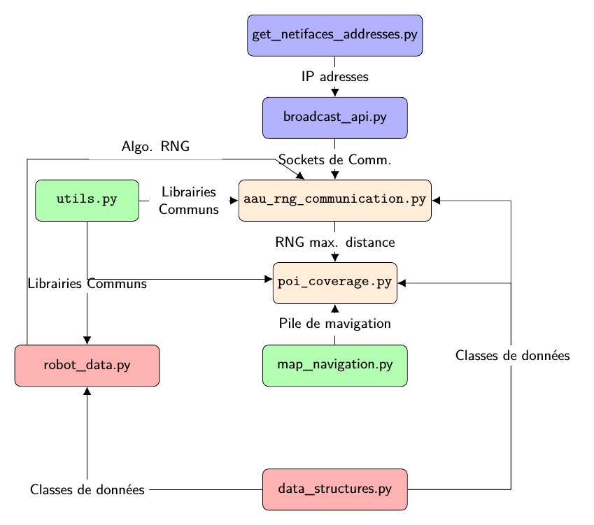

Auto-Organisation avec couverture de point d'intérêt
======================================================

Package AAU_RNG_MULTI_ROBOT
---------------------------
<div align="justify">
Le package  <code>aau_rng_multi_robot</code> est un package ROS qui est constitué de deux n&oelig;uds (i.e., nodes ROS). Brièvement, le premier node apporte la communication réseau et l'auto-organisation des robots à travers l'algorithme de construction d'un RNG Local (i.e., <strong>Local Relative Neighborhood Graph - LRNG</strong>). Il est identifiable par le nom <code>aau_rng_communication</code> dans la liste des nodes ROS (voir avec la commande <code>rosnode list</code>). Le second node décrit l'implémentation de l'algorithme de couverture de Point d'Intérêt (i.e. <strong>PoI</strong>), aussi appelé <code>poi_coverage</code>. Le package est installable dans un <code>catkin workspace : catkin_ws/src</code>.
</div>

### Préalable
<div align="justify">
Ce package est destiné à être exploité sur des robots <strong>Turtlebot2</strong>. Pour naviguer dans l'environnement, étant donné qu'on utilise le module <code>turtlebot_navaigation</code>, le second node ou <strong>PoI</strong> a besoin d'une map qui doit-être installée dans un répertoire <code>catkin_ws/src/maps/</code>. Donc, si ce répertoire n'existe pas, vous devriez le créer et copier les fichiers de votre map (e.g., <code>map_name.yaml</code> et <code>map_name.pgm</code>) à l'intérieur de ce répertoire. Vous devez également déclarer une variable d'environnement  dans le fichier <code>bashrc</code> de votre environnement de travail (i.e., <code>/home</code>) comme suit :
</div>

```bash
export TURTLEBOT_MAP_FILE=~/catkin_ws/src/maps/map_name.yaml

```
<div align="justify">
Ceci est une variable globale du module de navigation des robots <strong>Turtlebot2</strong> qui définit le chemin de la map à utiliser lors d'une navigation avec map (i.e., navigation assistée). Vous devez également modifier le fichier <code>amcl_demo.launch</code> pour y rajouter la position initiale  <code>x</code> et <code>y</code> qui répresente la position de son docker de charge. Vous devez naviguer jusqu'au module de navigation et modifier le à travers cette serie de commande shell.
</div>

```bash
$ roscd turtlebot_navigation/launch/
$ sudo vim/gedit/nano amcl_demo.launch  # Utilisez votre éditeur favoris: vim ou gedit ou nano
```

Vous aurez une sortie comme suit :
```bash
<launch>
  <!-- 3D sensor -->
  <arg name="3d_sensor" default="$(env TURTLEBOT_3D_SENSOR)"/>  <!-- r200, kinect, asus_xtion_pro -->
  <include file="$(find turtlebot_bringup)/launch/3dsensor.launch">
    <arg name="rgb_processing" value="false" />
    <arg name="depth_registration" value="false" />
    <arg name="depth_processing" value="false" />

    <!-- We must specify an absolute topic name because if not it will be prefixed by "$(arg camera)".                    Probably is a bug in the nodelet manager: https://github.com/ros/nodelet_core/issues/7 -->
    <arg name="scan_topic" value="/scan" />
  </include>

  <!-- Map server -->
  <arg name="map_file" default="$(env TURTLEBOT_MAP_FILE)"/>
  <node name="map_server" pkg="map_server" type="map_server" args="$(arg map_file)" />

  <!-- AMCL -->
  <arg name="custom_amcl_launch_file" default="$(find turtlebot_navigation)/launch/includes/amcl/$(arg 3d_sensor)_amcl.launch.xml"/>
  <arg name="initial_pose_x" default="0.0"/> <!-- Use 17.0 for willow's map in simulation -->
  <arg name="initial_pose_y" default="0.0"/> <!-- Use 17.0 for willow's map in simulation -->
  <arg name="initial_pose_a" default="0.0"/>
  <include file="$(arg custom_amcl_launch_file)">
    <arg name="initial_pose_x" value="$(arg initial_pose_x)"/>
    <arg name="initial_pose_y" value="$(arg initial_pose_y)"/>
    <arg name="initial_pose_a" value="$(arg initial_pose_a)"/>
  </include>

  <!-- Move base -->
  <arg name="custom_param_file" default="$(find turtlebot_navigation)/param/$(arg 3d_sensor)_costmap_params.yaml"/>
  <include file="$(find turtlebot_navigation)/launch/includes/move_base.launch.xml">
    <arg name="custom_param_file" value="$(arg custom_param_file)"/>
  </include>

</launch>
```
Vous devez modifier les deux lignes suivantes :
```bash
<arg name="initial_pose_x" default="0.0"/> <!-- Use 17.0 for willow's map in simulation -->
<arg name="initial_pose_y" default="0.0"/> <!-- Use 17.0 for willow's map in simulation -->
```
<div align="justify">
en y ajoutant la position initiale du robot lorsqu'il est en charge au niveau du docker de charge. <strong>Notez bien que, cette position initiale peut être aussi sa position initiale de départ sans docker de charge</strong>. Par exemple dans notre cas, nous avons un robot qui est initialement positionné à <code>(-0.94, -4.20)</code> dans notre map, donc son fichier <code>amcl_demo.launch</code> aura la sortie suivante :
</div>

```bash
<launch>
  <!-- 3D sensor -->
  <arg name="3d_sensor" default="$(env TURTLEBOT_3D_SENSOR)"/>  <!-- r200, kinect, asus_xtion_pro -->
  <include file="$(find turtlebot_bringup)/launch/3dsensor.launch">
    <arg name="rgb_processing" value="false" />
    <arg name="depth_registration" value="false" />
    <arg name="depth_processing" value="false" />

    <!-- We must specify an absolute topic name because if not it will be prefixed by "$(arg camera)".
     Probably is a bug in the nodelet manager: https://github.com/ros/nodelet_core/issues/7 -->
    <arg name="scan_topic" value="/scan" />
  </include>

  <!-- Map server -->
  <arg name="map_file" default="$(env TURTLEBOT_MAP_FILE)"/>
  <node name="map_server" pkg="map_server" type="map_server" args="$(arg map_file)" />

  <!-- AMCL -->
  <arg name="custom_amcl_launch_file" default="$(find turtlebot_navigation)/launch/includes/amcl/$(arg 3d_sensor)_amcl.launch.xml"/>
 <arg name="initial_pose_x" default="-0.94"/> <!-- (0.0) Use 17.0 for willow's map in simulation -->
 <arg name="initial_pose_y" default="-4.20"/> <!-- (0.0) Use 17.0 for willow's map in simulation -->
  <arg name="initial_pose_a" default="0.0"/>
  <include file="$(arg custom_amcl_launch_file)">
    <arg name="initial_pose_x" value="$(arg initial_pose_x)"/>
    <arg name="initial_pose_y" value="$(arg initial_pose_y)"/>
    <arg name="initial_pose_a" value="$(arg initial_pose_a)"/>
  </include>

  <!-- Move base -->
  <arg name="custom_param_file" default="$(find turtlebot_navigation)/param/$(arg 3d_sensor)_costmap_params.yaml"/>
  <include file="$(find turtlebot_navigation)/launch/includes/move_base.launch.xml">
    <arg name="custom_param_file" value="$(arg custom_param_file)"/>
  </include>

</launch>

```

Pour l'installation de ROS  sur le PC (i.e., Contrôleur) du robot, vous pouvez vous référer à [Learn TurtleBot and ROS](http://learn.turtlebot.com/).


### Structure hiérarchique du répertoire
Le contenu du package est organisé comme suivant :

```
aau_rng_multi_robot
├── CMakeLists.txt
├── include
│   └── aau_rng_multi_robot
├── launch
│   ├── aau_rng_adhoc_communication.launch
│   └── turtlebot_setup.launch
├── msg
│   ├── PointM.msg
│   ├── RecvString.msg
│   └── Robot.msg
├── package.xml
├── script
│   ├── aau_rng_communication.py
│   ├── broadcast_api.py
│   ├── data_structures.py
│   ├── get_netifaces_addresses.py
│   ├── map_navigation.py
│   ├── poi_coverage.py
│   ├── robot_data.py
│   └── utils.py
├── src
└── srv
    ├── MaxDistance.srv
    └── ShutDown.srv

```

<div align="justify">
Les fichiers <code>CMakeLists.txt</code> et <code>package.xml</code> sont inhérents à tout package ROS. Vous pouvez y jeter un &oelig;il  sur le contenu de ces deux fichiers. Les répertoires <em>msg</em>, <em>srv</em>, <em>launch</em>, <em>src</em> et <em>script</em> sont respectivement les répertoires des messages, des services, des fichiers de lancement, des n&oelig;uds (i.e. node) ou modules écrits en <code>C++</code> et les n&oelig;uds écrits en <code>Python</code>. Le répertoire <em>include</em> sert de répertoire de stockage des fichiers entêtes des modules écrits en <code>C/C++</code>.
</div>


##### Répertoire MSG
---------------------

<div align="justify">
Ce répertoire contient les messages crées (ou qui seront crées) et exploités (ou qui seront exploités) dans les modules du package. Actuellement, il y a trois messages déclarés, mais aucun n'est utilisé, mais pourront faire l'objet d'une utilisation future. Ils doivent-être déclarés, également, dans la section <code>## Generate message in the msg folder</code> du fichier <code>CMakeLists.txt</code> comme suit :
</div>

```
## Generate messages in the 'msg' folder
add_message_files(
   FILES
   RecvString.msg
   PointM.msg
   Robot.msg
)
```

##### Répertoire SRV
---------------------
<div align="justify">
Il contient les fichiers de services qui sont (ou seront) exploités dans le package <code>aau_rng_multi_robot</code>. Pour le moment, deux services ont été déclarés. Un premier service, <code>ShutDown.srv</code>, à appeler pour arrêter le n&oelig;ud. Ce service peut être implémenté dans n'importe quel node du package et peut être appelé par un node client pour arrêter le second node qui implémente la partie serveur. Le second service, <code>MaxDistance.srv</code>, est appelé par un client implémenté dans le module de couverture des points-d-intérêt (i.e., <strong>PoI</strong>). Le serveur est implémenté au niveau du node <code>aau_rng_communication</code>. Ce service fournit la distance maximale qu'a le robot avec ses robots voisins RNG Locaux. Cette distance est exploitée par l'algorithme <strong>PoI</strong> à travers la formule suivante :</div>

$$
d \le (R - d^+(u))
$$

```math
SE = \frac{\sigma}{\sqrt{n}}
```

<div align="justify">
Cette distance maximale des robots LRNG remplacera $$$d^+(u)$$$ dans la formulation précédente. Cette formule permet de calculer la distance à parcourir à chaque étape du processus de couverture du point d'intérêt.

A l'image des messages, les services doivent être déclarés dans la section <code>## Generate services in the 'srv' folder</code> du fichier <code>CMakeLists.txt</code> comme suit :
</div>

```
## Generate services in the 'srv' folder
add_service_files(
   FILES
   ShutDown.srv
   MaxDistance.srv
)
```

##### Répertoire Launch
-----------------------
Le répertoire <em>launch</em> contient deux fichiers de lancement :
 * turtlebot_setup.launch
 * aau_rng_adhoc_communication.launch

Ils doivent-être lancés dans l'ordre indiqué ci-dessus.

<div align="justify">
Le premier fichier, <code>turtlebot_setup.launch</code>, lance à son tour le fichier <code>bringup</code> qui démarre la base du <strong>Turtlebot2</strong>. Une fois que la base est démarrée, il lance ensuite le module de navigation assistée du robot. Ceci permet ensuite d'appeler des fonctionnalités de la navigation dans nos modules pour réaliser la couverture du point d'intérêt ou pour avoir la position du robot à tout instant dans la map de navigation. Son contenu est décrit ci-dessous :
</div>

```bash
<?xml version="1.0"?>
<launch>

   <include file="$(find turtlebot_bringup)/launch/minimal.launch"/>
   <include file="$(find turtlebot_navigation)/launch/amcl_demo.launch"/>

</launch>
```
Pour le lancer, il suffit de taper la commande suivante :

```bash
$ roslaunch aau_rng_multi_robot turtlebot_setup.launch

```
Lorsqu'il est lancé, au bout de quelques secondes, vous aurez une sortie similaire à ce qui est décrit ci-dessous :

```bash
[ INFO] [1572362731.039956109]: Using plugin "static_layer"
[ INFO] [1572362731.090427892]: Stopping device RGB and Depth stream flush.
[ INFO] [1572362731.145681233]: Requesting the map...
[ INFO] [1572362731.361477886]: Resizing costmap to 736 X 608 at 0.050000 m/pix
[ INFO] [1572362731.459412221]: Received a 736 X 608 map at 0.050000 m/pix
[ INFO] [1572362731.483779780]: Using plugin "obstacle_layer"
[ INFO] [1572362731.496212049]:     Subscribed to Topics: scan bump
[ INFO] [1572362731.694108520]: Using plugin "inflation_layer"
[ INFO] [1572362731.941120975]: Using plugin "obstacle_layer"
[ INFO] [1572362731.951648804]:     Subscribed to Topics: scan bump
[ INFO] [1572362732.200737349]: Using plugin "inflation_layer"
[ INFO] [1572362732.431471178]: Created local_planner dwa_local_planner/DWAPlannerROS
[ INFO] [1572362732.444681891]: Sim period is set to 0.20
[ INFO] [1572362732.992832405]: Recovery behavior will clear layer obstacles
[ INFO] [1572362733.028737855]: Recovery behavior will clear layer obstacles
[ INFO] [1572362733.195161000]: odom received!
```

<div align="justify">
Lorsque vous avez ce message <code>odom received!</code>, cela voudrait dire que votre module de navigation est prêt. Il est à présent possible d'exécuter le second fichier de lancement dont la description suit.

Le second fichier de lancement permet de démarrer nos deux nodes et son contenu est décrit ci-dessous :
</div>

```bash
<?xml version="1.0"?>
<launch>
   
 <node pkg="aau_rng_multi_robot" type="aau_rng_communication.py" name="aau_rng_communication">
     <param name="x_docker_pose" value="-0.94" />
     <param name="y_docker_pose" value="-4.20" />
     <param name="robot_name" value="sam" />
     <param name="interface" value="wlp2s0" />	
     <param name="hello_period" value="4" />
     <param name="neighbor_timeout" value="8" /> 
 </node>

<node pkg="aau_rng_multi_robot" type="poi_coverage.py" name="poi_coverage">
    <param name="comm_range" type="double" value="20"/>
    <param name="epsilon_error" type="double" value="0.5"/>
    <param name="x_first_pose" type="double" value="-4.50"/>
    <param name="y_first_pose" type="double" value="-3.80"/>
    <param name="x_goal_pose" type="double" value="-14.25"/>
    <param name="y_goal_pose" type="double" value="3.85"/>
</node>

</launch>
```

<div align="justify">
Les paramètres décrits entre le bloc <code><node...> ... </node></code> sont des entrées des modules. Par exemple le node <code>aau_rng_communication</code> a besoin de connaître l'interface réseau (e.g., <code>wlp2s0</code>) sur laquelle il crée les sockets de communication, la fréquence d'envoi des messages <em>HELLO</em>, la position initiale (x, y) du robot, etc. Tandis que le node de couverture du point d'intérêt a besoin de connaître la porte radio de communication, la position (x, y) du point à couvrir, etc. <strong>Dans tout autre cas d'usage, l'utilisation de ces paramètres (i.e., <code>hello_period</code>, <code>neighbor_timeout</code> et <code>comm_range</code>) tels qu'ils sont présentés ci-dessus doit faire l'objet d'une étude préalable, en expérimentation, avant toute exploitation en production</strong>.
</div>

Il se lance via la commande suivante :


```bash
$ roslaunch aau_rng_multi_robot aau_rng_adhoc_communication.launch

```

Elle donnera la sortie suivante:

```bash
started roslaunch server http://192.168.XX.XX:42245/

SUMMARY
========

PARAMETERS
 * /aau_rng_communication/hello_period: 4
 * /aau_rng_communication/interface: wlp2s0
 * /aau_rng_communication/neighbor_timeout: 8
 * /aau_rng_communication/robot_name: sam
 * /aau_rng_communication/x_docker_pose: -0.94
 * /aau_rng_communication/y_docker_pose: -4.2
 * /poi_coverage/comm_range: 20.0
 * /poi_coverage/epsilon_error: 0.5
 * /poi_coverage/x_first_pose: -4.5
 * /poi_coverage/x_goal_pose: -14.25
 * /poi_coverage/y_first_pose: -3.8
 * /poi_coverage/y_goal_pose: 3.85
 * /rosdistro: kinetic
 * /rosversion: 1.12.14

NODES
  /
    aau_rng_communication (aau_rng_multi_robot/aau_rng_communication.py)
    poi_coverage (aau_rng_multi_robot/poi_coverage.py)

ROS_MASTER_URI=http://localhost:11311

process[aau_rng_communication-1]: started with pid [31821]
process[poi_coverage-2]: started with pid [31822]

```

##### Répertoire Script
------------------------
<div align="justify">
Le répertoire des scripts contient l'ensemble des modules, au sens script python, qui constituent l'implémentation des nodes <code>aau_rng_communication.py</code> et <code>poi_coverage.py</code>. Leur diagramme fonctionnel est présenté  sur la figure ci-dessous :
</div>

<center>
   
</center>

<center>Diagramme fonctionnel des deux nodes du package AAU_RNG_MULTI_ROBOT</center>


<div align="justify">
Le diagramme fonctionnel des modules (i.e., nodes) est décrit par la figure ci-dessus. Cette figure montre des dépendances fonctionnelles qui existent entre les différents modules, d'un point de vue script python, constituant la solution d'auto-organisation et de couverture de point d'intérêt. Les deux nodes sont présentés par les deux blocs orange clair. Elle montre que le module <code>aau_rng_communication</code> dépend du module de communication réseau à travers les sockets de communication, et le module de gestion de l'interface réseau représenté ici par les blocs violets <code>broadcast_api</code> et <code>get_netifaces_addresses</code> respectivement, du module <code>robot_data</code> qui gère les informations sur le robot telles que le nom du robot, l'identifiant robot, la position instantanée du robot dans l'environnement (i.e., <em>map</em>), la liste de ses voisins directs, la liste de ces voisins RNG, et l'algorithme de construction du graphe RNG local, du module <code>data_structures</code> qui offre un certain nombre de classes et de variables afin de représenter les informations du robot, et la structure des paquets échangés sur le réseau via les messages de contôle <em>HELLO</em> et du module <code>utils</code>. Ce dernier est une librairie partagée qui regroupe un ensemble de fonctionnalités communes aux deux nodes ROS. Par exemple, il offre des fonctionnalités de sérialisation, et de désérialisation des messages envoyés sur le réseau, de calcul de distance, de verrouillage et de déverrouillage d'objets partagés, etc.  Le node <code>aau_rng_communication</code> offre des services au second node <code>poi_coverage</code> qui réalise la navigation vers la couverture du point d'intérêt via le module <code>map_navigation</code> et quelques fonctionnalités de la librairie partagée. Il est par conséquent fortement dépendant de la disponibilité du service <code>MaxDistance.srv</code> du node <code>aau_rng_communication</code>. Il ne sera démarré qu'après le démarrage du node <code>aau_rng_communication</code> donc implicitement la disponibilité du service <code>MaxDistance.srv</code>.
</div>
